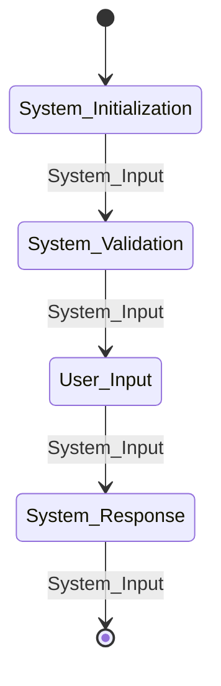

#  Project-talk
A repository housing useful models to neatly describe any project in an interview or a conference.

Essentially, when describing any project for someone for the first time, it requires a simplification model to proceed to the ideas, thus far.

**Vision:** While having a talk with a friend of mine, I stumbled a little while describing what I've achieved so far; I attribute this for the reason that most of my projects involve complex subsets of system engineering that is why they are bulky to describe just in an instant. To know from where you should begin describing a project, you should follow some standard algorithm in thinking. It might be first to describe the **problem** itself, then **a simple non-mathematical physical model**; eventually a most in-depth **system-model**, and if you are in a technical interview, the final model will be **a software architectural model**. **An automata model** is rarely required. However, it would serve a good model in conferences.

## Outline:
1) Defining **a physical model for the problem and its components**.
2) Defining **a physical model for the solution and its components; such that the solution subset components would map to the problem components based on the function theory**.
3) Defining **a system model for the project for the business and companies domain to be used in advertisements and non-technical conferences based on the SES Framework (System-Entity-Structure Framework)**.
4) Defining **a discrete mathematical model using the Automata Theory**.
5) Defining **a hybird automata model for analog-digital systems**.

## 1) A generic physical model for the problem and its components: 

## 2) A physical model for the solution and its components:

## 3) A system model for the business and companies' domains based on SES-Framework with emphasis on deployment:
> Copied, by Thorsten Pawletta.

**Definition:** The **System Entity Structure (SES)** is a _structural knowledge representation scheme_ introduced by **Zeigler**. It contains knowledge of **decomposition**, **taxonomy**, and  **coupling of a system**. In combination with **a Model Base (MB)**, it supports different concepts for system modeling, investigating design alternatives, reusing good designs, and collaborative modeling. 

Figure 1.6 shows the general procedure model of an **SES/MB-based M&S** according to **Pawletta et al**. Possible configurations of a system or a family of systems are analyzed. That means, basic dynamic components, their relations, and parameter settings are identified. Dynamic components are modeled or implemented as reusable basic systems with _defined input and output interfaces_ and _organized in a MB_. The possible system structures and parameter settings are modeled with an SES, which specifies **formal links to basic systems in the MB**. 

Figure 1.7 shows an example of an SES with associated MB. In the application phase, executable models are generated with **transformation methods** such as **pruning** and **build**. Based on defined objectives, _the pruning method derives a unique system configuration from the set of possible configurations_. The result of pruning is called **Pruned Entity Structure (PES)**. Based on the information in the PES, the build method generates an Executable Model using basic systems from the MB.

**Representation Schema:** An SES is represented by a **directed tree structure**, as illustrated in Fig. 1.7. The different **edges** are related to different **node types**. Each node can define attached variables, also called **attributes**. Real-world or imaginary objects are represented by entity nodes. _Entity attributes represent **properties** of the respective object_. The root and the leaves are always entities. **Relations** between entities are specified by **three types of descriptive nodes**, called **aspect**, **multi-aspect**, and **specialization**. The attributes of descriptive nodes specify relations between their parent node and children nodes or decisions for the pruning process. 

**Relations:** Aspects describe how entities can be decomposed in partial entities. Coupling relations can be specified in a couplings attribute. Multi-aspects describe the decomposition of an entity into entities of the same class. They define an additional attribute, called Number of Replications (numRep). The taxonomy of an entity is described by specialization(s) and concerns admissible variants of an entity. Rules for selecting a variant during pruning can be defined in a selection rule attribute. With the extended procedural knowledge representation according to Pawletta et al., attributes can be dynamically assigned values. For example, coupling relations of a multi-aspect can result dependent on the value of attribute numRep.

**Semantics:** The semantics of the SES is defined by **axioms**. Types of each node have to follow the axiom alternating mode. Every entity node has to be followed by a descriptive node, and vice versa. A strict hierarchy is needed. In every path of the tree, a name of a node may occur only once. _If nodes in different paths have the same name, they need to have the same variables and isomorphic partial trees._ This is called **uniformity**. 

Nodes on the same level of a hierarchy, called sibling nodes, have to be valid brothers, meaning that sibling nodes must not have the same name. The axiom of attached variables implies that a node must not have variables of the same name. The axiom of inheritance implies that during pruning, the parent and the child of a specialization combine their variables, aspects, and specializations. The configurations modeled in an SES tree can be delimited by selection constraints and semantic conditions.

> [!NOTE]
> There are numerous additional SES concepts, such as using the SES as a general ontology for data modeling, the specification of abstraction hierarchies and time granularities for families of systems, interfaces for automated, reactive pruning, methods for the pruning of deep hierarchies of certain node type combinations, or the combination with performance metrics to evaluate and select the best possible system configurations.

## 4) A discrete mathematical model using the Automata Theory:

> [!NOTE]
> The preceding figure is a generalized example for describing some project steps using the abstract mathematical model, the finite-state automata model. A formalization of the model could be attained using the following:
> * Let, $$Q = \\{System_{Initialization}, System_{Validation}, User_{Input}, System_{Response}\\}$$ be the set of active states, and $$q_0 = \\{System_{Initialization}\\}$$ be the start or the initial state, $$\Sigma = \\{i_0, i_1, i_2, i_3\\}$$ be the set of transition inputs, $$\delta: Q \times \Sigma \rightarrow Q$$ be the transition function, $$F = \\{System_{Response}\\}$$ be the set of accepting states; such that $$f \in Q$$, and $$F \subseteq Q$$.
> * Then, a Machine $$M$$ could be constructed as a quintuple sequence of members; $$M = (Q, \Sigma, \delta, q_0, F)$$, and in this particular example, it would be:
> $$M = (\\{System_{Initialization}, System_{Validation}, User_{Input}, System_{Response}\\}, \\{i_0, i_1, i_2, i_3\\}, \delta: Q \times \Sigma \rightarrow Q, \\{System_{Initialization}\\}, \\{System_{Response}\\})$$, and if $$S \subseteq Q$$ and $$\Sigma^\* = \\{\sigma_{0}\sigma_{1}\sigma_{2}...\sigma_{k} | k, i \in N \land \sigma_{i} \in \Sigma\\}$$ is a closure from $$\Sigma$$; then, $$\Delta(S, \Sigma^\*) = \\{\delta(q, \sigma) | \delta(q_i, \sigma_{i+1})_{i+1} \in Q \land i \in [0, k-1]\\} = \\{q\_{i+1} | q\_{i+1} \in Q \land i \in [0, k-1]\\}$$ is the set of the range (or the co-domain) of the function $$\delta$$.
>
> The language of the machine $$L(M)$$ is the set of recognizable strings of the automata; a recognizable string results from the successive execution of the transition functions with a subset of inputs beginning from the start state until an accepting state is being hit by the automata process; hence the string is recognized; therefore, $$L(M) = \\{s_n | n \in N \land s_n \in \Sigma\^* \land \Sigma\^* = \\{\sigma_{0}\sigma_{1}\sigma_{2}...\sigma_{k} | k, i \in N \land \sigma_{i} \in \Sigma\\}\\}$$ is the language of the automata $$M$$ and the set of all acceptable strings over the set of transition functions collection $$\Delta(S, \Sigma\^\*)$$; where $$S \subseteq Q$$.

## 5) A hybird automata model for analog-digital systems (i.e., mixed discrete and continuous systems):
> WIP

## References:
* [Body of Knowledge for Modeling and Simulation Tuncer Ören Bernard P. Zeigler Andreas Tolk Editors A Handbook by the Society for Modeling and Simulation, Springer](https://link.springer.com/book/10.1007/978-3-031-11085-6).
* [Software Engineering Design by Carlos Otero](https://www.amazon.com/Software-Engineering-Design-Practice-Applied/dp/1439851689).
* [Guide to Discrete Mathematics, Springer](https://link.springer.com/book/10.1007/978-3-030-81588-2)
* [Discrete Mathematical Structures by Bernard Kolman](https://www.amazon.com/Discrete-Mathematical-Structures-Pearson-International/dp/1292024844).
